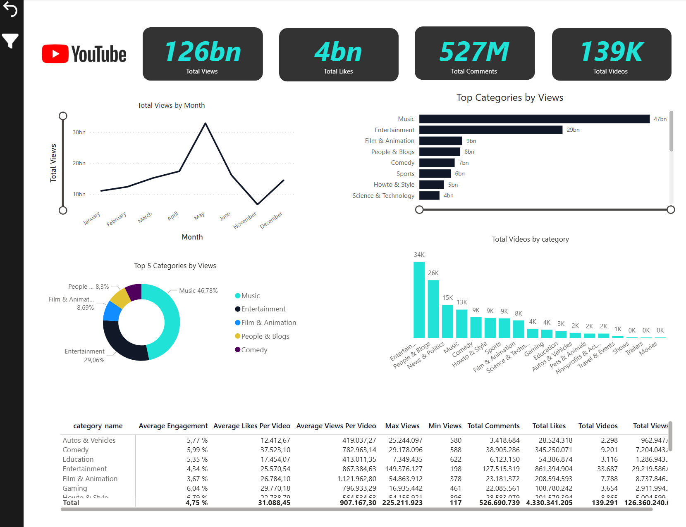
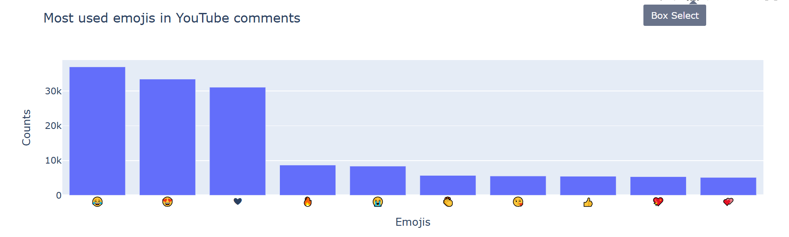
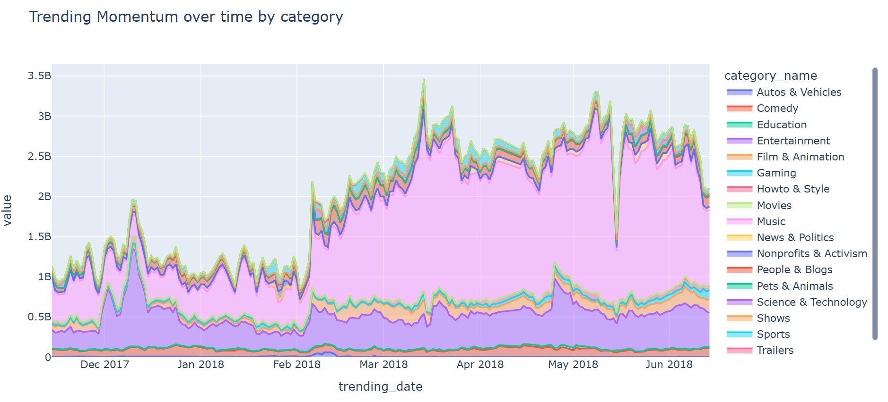
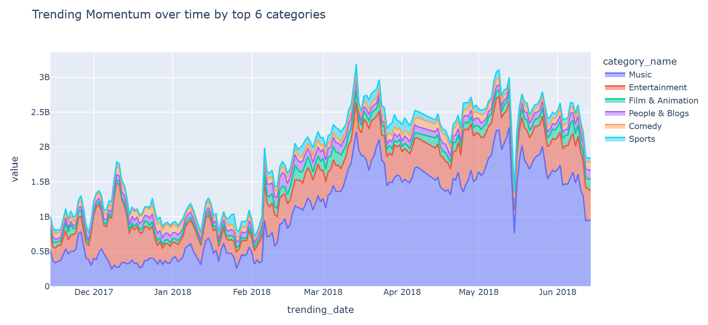
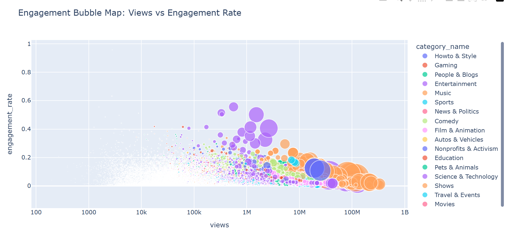
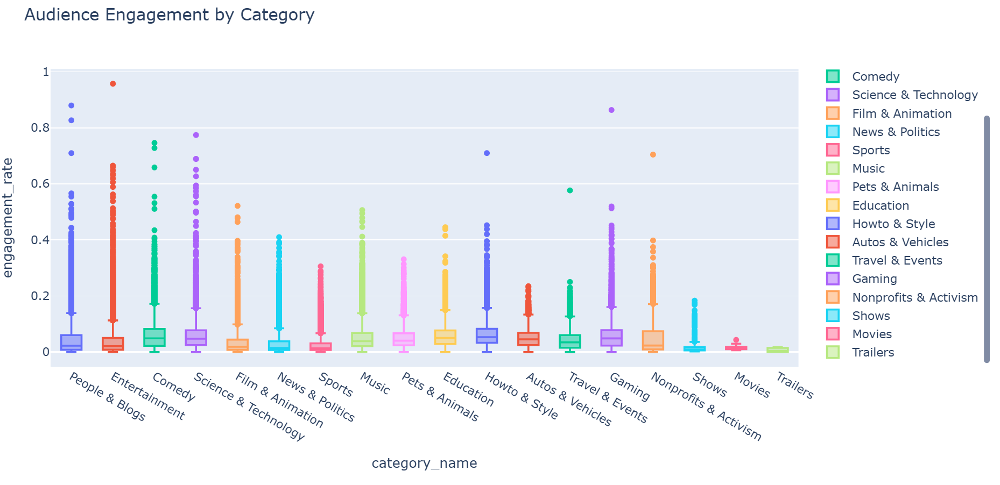
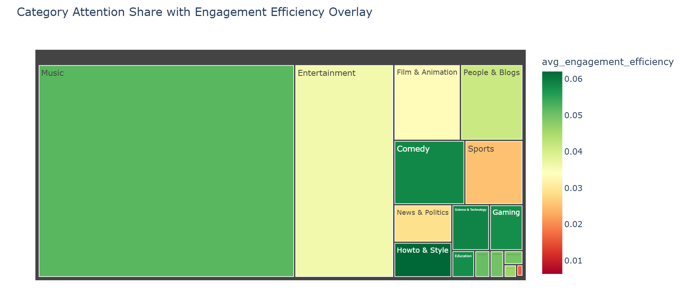

# 📊 YouTube Data Analysis

## Overview

This end-to-end data analytics project analyzes YouTube video and comment data using **Python, SQL, and Power BI**.

Python was used for data preparation, exploratory data analysis, sentiment analysis, emoji extraction, and interactive visualizations. SQL was used to query structured video data, calculate engagement metrics, and compare category performance. Power BI was used to build an interactive dashboard that presents key performance indicators, monthly trends, and category-level insights.

The project demonstrates a complete analytics workflow, from data cleaning and analysis to dashboard development and business insight generation.

---

## 🔄 Project Workflow

The project follows a complete data analytics workflow:

```text
Raw YouTube Dataset
        │
        ▼
Data Preparation (Python)
        │
        ▼
Exploratory Data Analysis (EDA)
        │
        ▼
Sentiment & Emoji Analysis
        │
        ▼
SQL Business Analysis
        │
        ▼
Power BI Dashboard
        │
        ▼
Business Insights
```
---

## Dataset

The dataset contains YouTube video metadata and user comments used for sentiment, engagement, and category analysis.

**Note:** The dataset is not included in this repository due to size and licensing considerations.

---

## 🛠️ Technologies Used

### Python

- Pandas
- NumPy
- Plotly
- NLTK
- VADER Sentiment Analysis
- Emoji
- Jupyter Notebook

### SQL

- PostgreSQL
- SQLite
- Joins
- Aggregate Functions
- GROUP BY
- Window Functions

### Power BI

- Power BI Desktop
- Power Query
- Data Modeling
- DAX
- KPI Cards
- Interactive Dashboard
- Slicers & Filters

### Development Tools

- Git
- GitHub

---

## 🐍 Python Analysis

Python was used for data preparation, exploratory data analysis, and sentiment analysis to better understand YouTube video performance and audience engagement.

### Data Preparation

The dataset was prepared through several preprocessing steps, including:

- Handling missing values
- Removing duplicate records
- Data type conversion
- Feature engineering
- Data validation

### Exploratory Data Analysis (EDA)

The exploratory analysis focused on identifying patterns and trends in the dataset, including:

- Video performance analysis
- Category distribution
- Views, likes, and comments analysis
- Trending content exploration

### Sentiment Analysis

User comments were analyzed using **VADER Sentiment Analysis** to classify comments into:

- Positive
- Neutral
- Negative

### Emoji Analysis

Emoji extraction was performed to identify frequently used emojis and explore their relationship with audience sentiment.

### Visualizations

Interactive visualizations were created using Plotly to present key findings and support data exploration.

---
## 🗄️ SQL Analysis

SQL was used to explore the dataset, answer business questions, and calculate key performance metrics.

The analysis includes:

- Category performance comparison
- Total views, likes, and comments by category
- Average engagement metrics
- Video count by category
- Ranking categories based on popularity
- Aggregation and grouping of data
- Business-oriented analytical queries

---
## 📊 Power BI Dashboard

An interactive Power BI dashboard was developed to transform the analysis into a business intelligence report.

The dashboard enables users to monitor YouTube performance, compare categories, and explore engagement metrics through interactive visualizations.

### Dashboard Preview



### Dashboard Features

- KPI Cards (Total Views, Total Likes, Total Comments, Total Videos)
- Monthly Views Trend
- Top Categories by Views
- Top 5 Categories Distribution
- Total Videos by Category
- Category Performance Summary Table
- Interactive Category Slicer
- Cross-filtering between visualizations
- Reset Filter Button

The complete dashboard file is available in the **[power-bi](power-bi/)** folder.

---
## 🔍 Key Findings

The analysis revealed several insights from the YouTube trending dataset:

- Music and Entertainment categories generated the highest number of views.
- Audience engagement varied significantly across content categories.
- Trending videos received substantially higher interaction rates than average videos.
- Sentiment analysis showed that most user comments were positive or neutral.
- The Power BI dashboard enables interactive exploration of category performance and engagement metrics.

---

## 💼 Key Skills Demonstrated

- Data Cleaning and Preprocessing
- Exploratory Data Analysis (EDA)
- Sentiment Analysis using VADER
- SQL Querying and Business Analysis
- Data Modeling
- DAX Measures
- Power BI Dashboard Development
- Interactive Data Visualization
- Business Intelligence Reporting
- Git & GitHub

---

## 📂 Repository Structure

```text
youtube-data-analysis/
│
├── README.md                      # Project documentation
├── requirements.txt               # Python dependencies
├── youtube_data_analysis.ipynb    # Python analysis notebook
│
├── images/                        # Python visualization outputs
│
├── sql/                           # SQL scripts
│   ├── create_tables.sql
│   ├── import_data.sql
│   └── analysis_queries.sql
│
└── power-bi/
    ├── README.md                  # Power BI documentation
    ├── youtube_data_dashboard.pbix
    └── screenshots/
        └── youtube-dashboard.PNG
```

---

## How to Run

Install the required packages:

```bash
pip install -r requirements.txt
```

Launch Jupyter Notebook:

```bash
jupyter notebook
```

Open and run:

```bash
youtube_data_analysis.ipynb
```

---

## 📈 Sample Visualizations

### Most Used Emojis


### Category Trending Momentum


### Top Categories Trend


### Views vs Engagement


### Audience Engagement by Category


### Category Engagement Efficiency

---

## Author

**Melika Ghanbari**

Data Analytics Enthusiast
